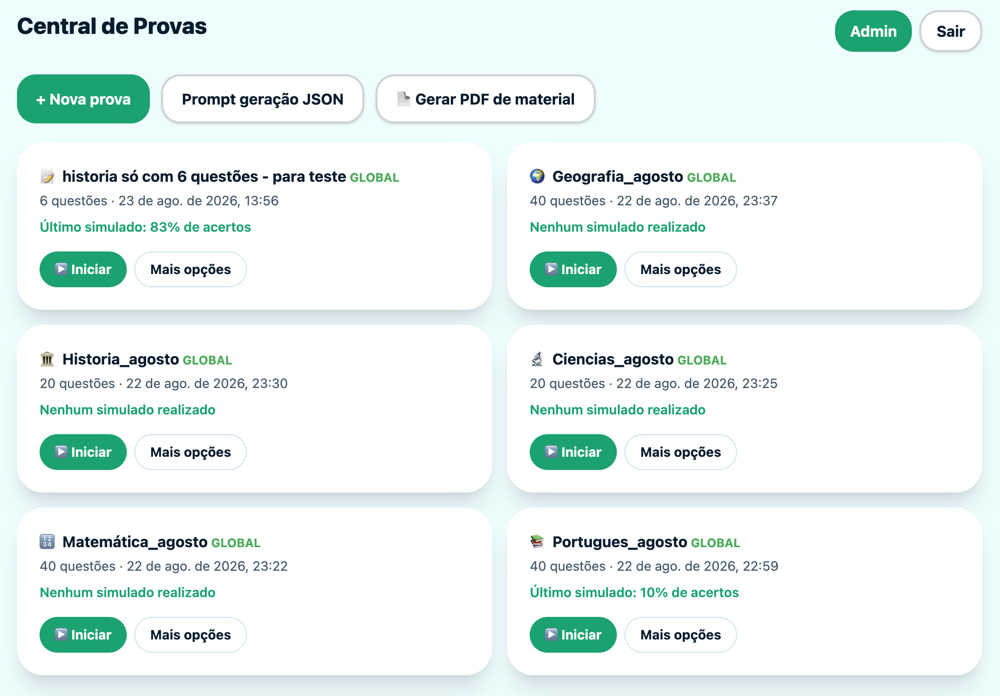
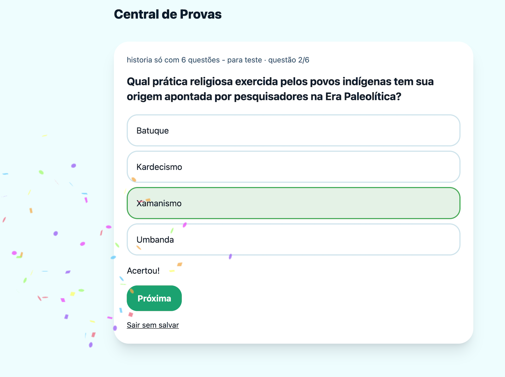
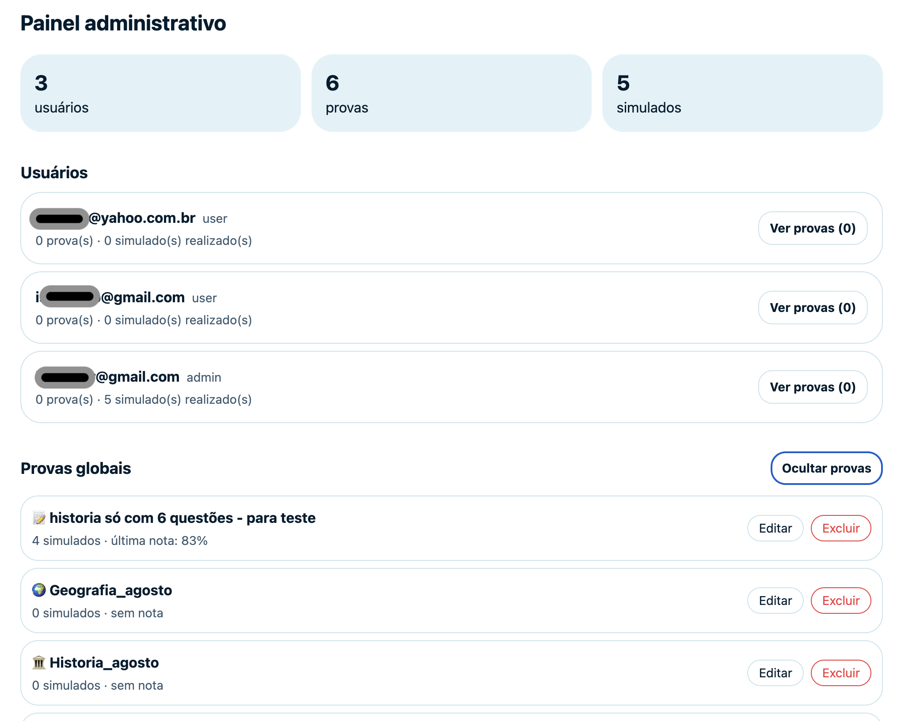
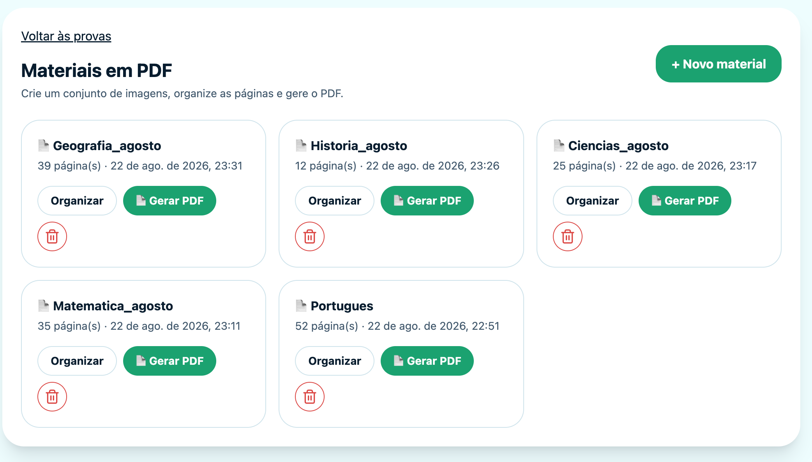

# Central de Provas

Aplicação de provas, simulados e histórico por usuário, construída com React, TanStack Start e Supabase.

## Telas da aplicação

### Central de provas

Crie, inicie e acompanhe provas globais ou particulares, com a nota do último simulado em cada card.



### Simulado interativo

Responda uma questão por vez, receba dicas e comemore os acertos com confetes.



### Painel administrativo

Acompanhe usuários, totais de provas e simulados, além das provas globais da aplicação.



### Materiais em PDF

Crie conjuntos de imagens, organize as páginas e gere um PDF para download.



### Organização de páginas

Reordene páginas por arrastar e soltar ou pelo número de página, com rotação e revisão visual.


## Configuração local

1. Crie um projeto em [Supabase](https://supabase.com) e habilite o provedor **Email** em Authentication.
2. No SQL Editor, execute os arquivos ainda pendentes de `supabase/migrations` em ordem cronológica. Em uma instalação nova, execute todos; em uma instalação existente, não execute novamente os arquivos já aplicados.
3. Copie `.env.example` para `.env.local` e preencha a URL, a chave pública e, somente para o seed, a Service Role Key do projeto.
4. Instale e inicie:

```bash
npm install
npm run seed:geography
npm run dev
```

Para a confirmação por e-mail funcionar em outro dispositivo da rede, abra **Authentication > URL Configuration** no Supabase. Em **Redirect URLs**, adicione `http://localhost:8080/**` e o endereço de rede exibido pela aplicação, por exemplo `http://192.168.15.21:8080/**`. Defina esse endereço de rede como **Site URL** se ele for o acesso principal. O cadastro envia automaticamente o endereço atual do navegador como redirecionamento.

O seed lê as 40 perguntas existentes em `src/data/quiz-geografia.ts` e cria ou atualiza a prova global **Prova de Geografia**. Nunca exponha `SUPABASE_SERVICE_ROLE_KEY` no navegador ou em um repositório.

## Deploy no Cloudflare

No painel do Cloudflare, adicione estas variaveis em **Workers & Pages > quiz > Settings > Builds > Build variables** antes do proximo deploy:

```text
VITE_SUPABASE_URL=https://SEU-PROJETO.supabase.co
VITE_SUPABASE_PUBLISHABLE_KEY=sua_chave_publica_do_supabase
```

Elas sao valores publicos usados pelo navegador e precisam existir durante `npm run build`; adiciona-las apenas em **Runtime variables and secrets** nao as inclui no bundle da aplicacao. Se algum endpoint de servidor vier a usar `SUPABASE_SERVICE_ROLE_KEY`, cadastre-a somente como **Secret** em runtime e nunca use o prefixo `VITE_`.

O `wrangler.jsonc` usa `keep_vars: true`, portanto os proximos `wrangler deploy` preservam as variaveis e secrets configurados no Dashboard. As duas variaveis `VITE_*` que ja foram removidas precisam ser cadastradas novamente no ambiente de build uma vez.

Ao enviar uma prova, o e-mail do destinatário é salvo na tabela `amigos` da conta que enviou. O destinatário precisa continuar previamente cadastrado; a aplicação valida isso a cada novo compartilhamento.

## Materiais em PDF

Os recursos de materiais dependem destas migrações, já incluídas na execução cronológica: `20260822201000_materiais_pdf.sql`, `20260822202000_rotacao_material.sql`, `20260822203000_corrigir_rotacao_nula.sql`, `20260822204000_reordenar_paginas_material.sql`, `20260822205000_simplificar_reordenacao_material.sql`, `20260822206000_paginas_corrigidas.sql` e `20260822207000_marcar_paginas_maiores_que_90_corrigidas.sql`. Elas criam as tabelas de materiais e páginas, o bucket privado `materiais`, os campos de rotação e correção, e a atualização da posição de uma única imagem.

Na central, use **Gerar PDF de material** para criar um conjunto, ordenar as imagens por arrastar e soltar ou pelo número da página, girá-las, marcar páginas corrigidas e baixar o PDF.

As migrações mais recentes também impedem o compartilhamento de provas globais (`20260823133000_impedir_compartilhamento_prova_global.sql`) e permitem que administradores editem provas globais (`20260823143000_admin_editar_prova_global.sql`).

## Atualizar o schema SQL

O arquivo `supabase/schema.sql` é uma fotografia do schema remoto atual, com tabelas, funções e políticas. Abra o Docker Desktop antes de executar o dump, pois o Supabase CLI usa o Docker para rodar o `pg_dump`.

Vincule o projeto somente na primeira vez:

```bash
npx supabase login
npx supabase link --project-ref knkbkuhqepuoumokckam
```

Para criar ou atualizar o arquivo de schema:

```bash
npx supabase db dump --linked -f supabase/schema.sql
```

Revise o resultado com `git diff -- supabase/schema.sql` antes de versioná-lo. O dump não inclui dados, usuários do Auth, configurações de autenticação nem objetos do Storage; mantenha as migrações para esses recursos.

## JSON de importação

```json
[
  {
    "q": "Qual é a capital do Brasil?",
    "a": ["Rio de Janeiro", "Brasília", "São Paulo", "Salvador"],
    "correct": 1,
    "hint": "Ela fica no Distrito Federal."
  }
]
```

Cada prova precisa ter ao menos uma questão. Cada questão exige texto, dica, exatamente quatro alternativas e `correct` entre `0` e `3`.

## Manutenção

Instale ou atualize as dependências:

```bash
npm install
```

Inicie a aplicação somente nesta máquina:

```bash
npm run dev
```

Inicie a aplicação acessível pela rede local, por exemplo no iPad:

```bash
npm run dev -- --host 0.0.0.0
```

Atualize a prova global de Geografia:

```bash
npm run seed:geography
```

Pare o servidor no terminal em que ele está rodando com `Ctrl+C`. Caso tenha perdido esse terminal, encontre e encerre o processo da porta `8080`:

```bash
lsof -ti tcp:8080
kill PID
```

Substitua `PID` pelo número retornado pelo primeiro comando.

## Verificações

```bash
npm test
npx tsc --noEmit
npm run build
```
